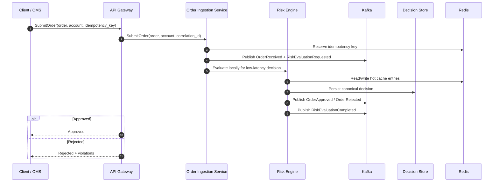
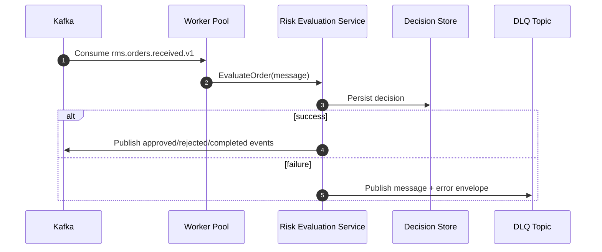

# Phase 2 Risk Pipeline

This document is the canonical design reference for the phase 2 distributed real-time risk management pipeline.

The codebase is organized into:

- `client/`: operator and supervisory UI surfaces
- `server/`: canonical phase 2 backend services
- `shared/`: runtime compatibility libraries and shared proto messages
- `proto/`: source-of-truth protobuf contracts for generated clients and servers

## 1. Service Architecture

```text
Trader / OMS / Internal UI
          |
          v
   client/admin-dashboard
          |
          v
       API Gateway
          |
          +---------------------------+
          |                           |
          v                           v
 Order Ingestion Service        Rule Engine Service
 (sync pre-trade decision)      (dynamic rule catalog)
          |
          v
 Risk Evaluation Service
 (Kafka consumer group + worker pool)
          |
          +-----------------------------+
          |                             |
          v                             v
        Kafka                          Redis
 (durable event bus)        (idempotency, dedupe, hot cache)
          |
          v
  Decision Store / JSONL WAL

Cross-cutting:
- OpenTelemetry traces and request IDs
- Structured logging
- gRPC health and reflection
- Dead-letter topics for failed events
```

The synchronous path is the edge-facing submit path and uses the embedded `risk.Engine` inside the order ingestion service for low-latency approval or rejection.
The asynchronous path replays the same order stream through Kafka for durable processing, auditability, and downstream fan-out.

## 2. Order Processing Sequence Diagrams

### 2.1 Synchronous Submit Path



The rule engine snapshot is refreshed on a background timer and via explicit reload events; it is not fetched on every submit.

### 2.2 Kafka Reprocessing Path



## 3. Kafka Event Flow

### Primary topics

| Topic | Producer | Consumer(s) | Purpose |
| --- | --- | --- | --- |
| `rms.orders.received.v1` | Order Ingestion Service | Risk Evaluation Service | Durable order ingress event |
| `rms.risk.evaluation.requested.v1` | Order Ingestion Service | Risk Evaluation Service / observability consumers | Queue signal for pre-trade evaluation |
| `rms.orders.approved.v1` | Risk Evaluation Service | OMS / downstream workflows | Canonical approval event |
| `rms.orders.rejected.v1` | Risk Evaluation Service | OMS / alerting / compliance | Canonical rejection event |
| `rms.risk.evaluations.completed.v1` | Risk Evaluation Service | Audit, analytics, and telemetry consumers | Terminal decision event |
| `rms.risk.alerts.triggered.v1` | Risk Evaluation Service | Alerting service | High-severity rule breach |
| `rms.rules.changed.v1` | Rule Engine Service | Risk and ingestion caches | Rule snapshot version change |

### DLQ topics

| Topic | Purpose |
| --- | --- |
| `rms.orders.received.v1.dlq` | Failed Kafka consumption / deserialization / processing |

### Flow rules

- Event envelopes are immutable.
- `event_id` is stable and deterministic per decision.
- `correlation_id` and `trace_id` propagate from the edge through Kafka and gRPC.
- Ordering is preserved per `tenant_id|account_id|order_id` partition key.
- DLQ payloads retain the original envelope, raw payload, offset, and service error.

## 4. gRPC Proto Contracts

### Source files

- [`proto/orders/v1/orders.proto`](../proto/orders/v1/orders.proto)
- [`proto/risk/v1/risk_pipeline.proto`](../proto/risk/v1/risk_pipeline.proto)
- [`proto/rules/v1/rules.proto`](../proto/rules/v1/rules.proto)

### Canonical services

- `OrderIngestionService`
  - `SubmitOrder`
  - `GetOrderDecision`
  - `StreamOrderDecisions`
- `RiskEvaluationService`
  - `EvaluateOrder`
  - `BatchEvaluateOrders`
  - `GetDecision`
  - `StreamOrderEvaluations`
- `RuleEngineService`
  - `GetActiveRules`
  - `EvaluateRules`
  - `ReloadRules`
  - `StreamRuleUpdates`

### Compatibility layer

The current runtime uses the handwritten compatibility package under `shared/proto` so the repository remains runnable before full generated code integration.
Generated Go output should land under `generated/go/`.

## 5. REST API Contracts

### Order Ingestion Service

| Method | Path | Purpose |
| --- | --- | --- |
| `POST` | `/v1/orders` | Submit an order for pre-trade evaluation |
| `GET` | `/v1/orders/{order_id}` | Fetch the latest stored decision |
| `GET` | `/healthz` | Service health check |
| `GET` | `/metrics` | Prometheus metrics |

### Risk Evaluation Service

| Method | Path | Purpose |
| --- | --- | --- |
| `GET` | `/v1/decisions/{order_id}` | Query a stored risk decision |
| `GET` | `/healthz` | Service health check |
| `GET` | `/metrics` | Prometheus metrics |

### Rule Engine Service

| Method | Path | Purpose |
| --- | --- | --- |
| `GET` | `/v1/rules` | List active rules with tenant/account/symbol scoping |
| `POST` | `/v1/rules/reload` | Reload rule snapshots from Redis or JSON payload |
| `GET` | `/healthz` | Service health check |
| `GET` | `/metrics` | Prometheus metrics |

### Gateway edge

The API gateway remains the external entry point and forwards submit requests to the order ingestion service.

| Method | Path | Purpose |
| --- | --- | --- |
| `POST` | `/v1/orders/evaluate` | Submit an order through the edge |
| `POST` | `/v1/orders/batch-evaluate` | Batch order evaluation |
| `POST` | `/v1/orders/cancel` | Cancel request passthrough |
| `GET` | `/v1/accounts/{id}` | Account snapshot |
| `GET` | `/v1/marketdata/latest` | Latest market data |

## 6. Redis Caching Strategy

| Key pattern | TTL | Purpose |
| --- | --- | --- |
| `rms:idempotency:{tenant}:{idempotency_key}` | decision TTL | Prevent duplicate processing |
| `rms:fingerprint:{tenant}:{account}:{fingerprint}` | duplicate window | Replay and duplicate detection |
| `rms:frequency:{tenant}:{account}:{bucket}` | frequency window | Burst-rate control |
| `rms:decision:{tenant}:{order_id}` | decision TTL | Fast decision lookup |
| `rms:decision:correlation:{tenant}:{correlation_id}` | decision TTL | Correlated lookup |
| `rms:account:{tenant}:{account}` | short hot TTL | Account snapshot cache |
| `rms:market:{tenant}:{symbol}` | short hot TTL | Latest symbol price for fat-finger checks |
| `rms:rules:version:{tenant}` | long hot TTL | Active rule snapshot version |

### Redis usage notes

- Use `SETNX` for idempotency and fingerprint reservation.
- Use pipelining for frequency increments and decision writes.
- Use short TTLs on market and account caches to keep the decision path hot without long-lived staleness.
- Query paths prefer Redis first, then the append-only decision store.

## 7. Go Concurrency Model

- Order evaluation is executed on a bounded worker pool.
- Kafka consumption uses a consumer group so partitions scale horizontally.
- Each message is processed in a single job goroutine to keep the hot path predictable.
- The risk engine is intentionally stateless aside from Redis and the decision store.
- Shared state is limited to:
  - Redis connection management
  - decision store indexes
  - connection caches for gRPC clients
- The hot path avoids coarse global locks.
- Context cancellation is respected for shutdown and retry boundaries.

## 8. Rule Engine Design

- Rules are loaded from Redis snapshots or JSON bootstrap payloads.
- Hot reload refreshes the in-memory catalog on a timer and on explicit API invocation.
- An unscoped rule fetch returns the full enabled catalog so downstream services can keep one canonical in-memory snapshot.
- Rules support:
  - tenant-level scoping
  - account-level overrides
  - symbol restrictions
  - priority ordering
  - chained rule execution
  - configurable thresholds
  - stop-on-failure semantics
- Default rules cover:
  - max order size
  - buying power
  - leverage
  - market-hours validation
  - duplicate order detection
  - excessive frequency detection
  - restricted symbol validation
  - fat-finger checks
  - account status validation

## 9. Idempotency Strategy

- Clients provide an `idempotency_key` on submit.
- If omitted, the system derives a stable fingerprint from the order payload.
- The order ingestion service reserves the idempotency key with Redis `SETNX`.
- The risk engine generates a stable decision identifier from `order_id` and the idempotency key.
- Duplicate detection is layered:
  - idempotency reservation
  - fingerprint window
  - frequency window
  - decision-store replay lookups

## 10. Retry Mechanisms

- Kafka event handling uses bounded retry with exponential backoff and jitter.
- Redis and rule snapshot refresh use short retry windows so the request path stays fast.
- Retry budgets are intentionally small because the pipeline is side-effecting and should not stall indefinitely.
- When retries exhaust, the message is routed to a DLQ with the original envelope and error metadata.

## 11. Dead-Letter Handling

DLQ messages should retain:

- source topic
- partition and offset
- message key
- failure reason
- service name
- trace ID
- correlation ID
- original payload
- original envelope
- published timestamp

DLQ processing should be replayable and idempotent.

## 12. Risk Evaluation Pipeline

1. Order arrives at the gateway.
2. Gateway forwards to the order ingestion service.
3. Order ingestion reserves idempotency and normalizes correlation metadata.
4. Order ingestion publishes `OrderReceived` and `RiskEvaluationRequested`.
5. Order ingestion triggers a low-latency local evaluation for the synchronous response.
6. Risk evaluation applies the rule engine, Redis hot cache, and market/account checks.
7. Risk evaluation persists the canonical decision and publishes terminal events.
8. Consumer workers process Kafka replays and route failures to DLQ.

## 13. Benchmarking Approach

- Measure `SubmitOrder` and `EvaluateOrder` latency separately.
- Track p50, p95, and p99 latency under steady-state and burst load.
- Record allocations with `-benchmem`.
- Profile:
  - CPU
  - heap
  - goroutine count
  - lock contention
- Compare:
  - direct gRPC path
  - Kafka consumer path
  - cache hit vs cache miss

## 14. Load Testing Design

- Single-account burst test to validate duplicate and frequency controls.
- Multi-account mixed symbol test to validate partition locality.
- Rule reload test while traffic is in flight.
- Redis degradation test to verify graceful fallback behavior.
- Kafka partition rebalance test to validate consumer group stability.
- Replay test that reprocesses the same order stream and verifies idempotency.

Recommended tools:

- `k6` or `vegeta` for HTTP/gRPC edge pressure
- `kafka-producer-perf-test` for broker throughput
- `redis-benchmark` for cache sizing

## 15. Failure Handling Strategy

- Pre-trade order submission should fail closed when the order ingestion service or risk engine cannot make a deterministic decision.
- Cached decisions are used to satisfy read paths when the live path is temporarily unavailable.
- Kafka publish failures do not invalidate a persisted decision, but they must be surfaced and observable.
- Snapshot refresh failures keep the last known good rule set active.
- DLQ is the only acceptable terminal sink for poison messages.
- Alerting should fire on:
  - sustained consumer lag
  - DLQ spikes
  - Redis error bursts
  - rule snapshot reload failures
  - order ingestion latency regressions

## Related Files

- [`server/README.md`](../server/README.md)
- [`docs/architecture.md`](architecture.md)
- [`docs/sequence-diagrams.md`](sequence-diagrams.md)
- [`docs/kafka/topics.md`](kafka/topics.md)
- [`docs/kafka/event-schemas.md`](kafka/event-schemas.md)
- [`proto/README.md`](../proto/README.md)
