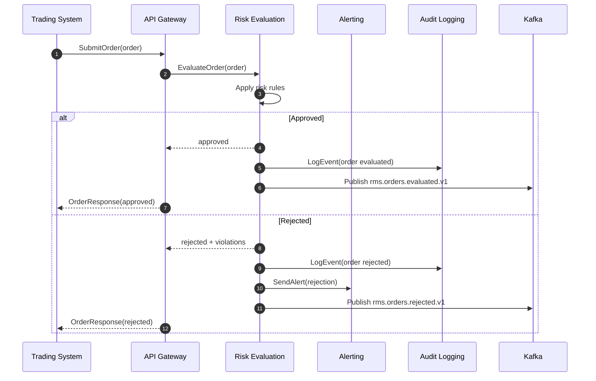
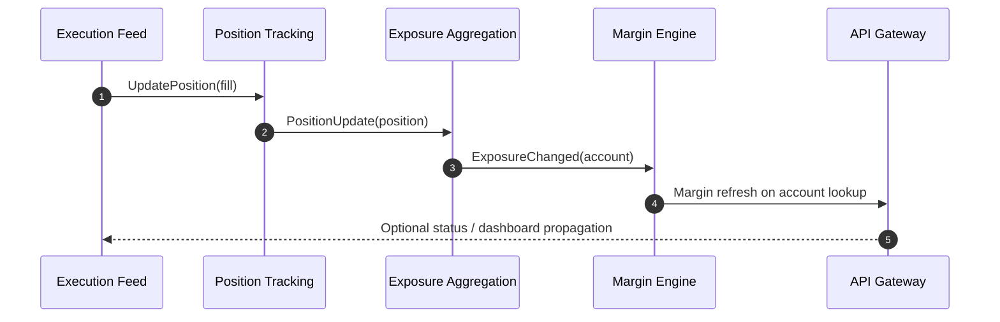
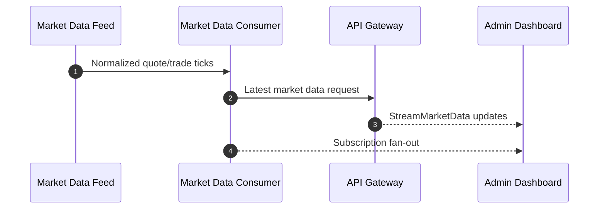

# RMS Sequence Diagrams

This file preserves phase 1 sequence references.
The canonical phase 2 diagrams live in
[`phase-2-risk-pipeline.md`](phase-2-risk-pipeline.md).

## Pre-Trade Risk Evaluation

## Post-Trade Exposure Update

## Market Data Fan-Out

